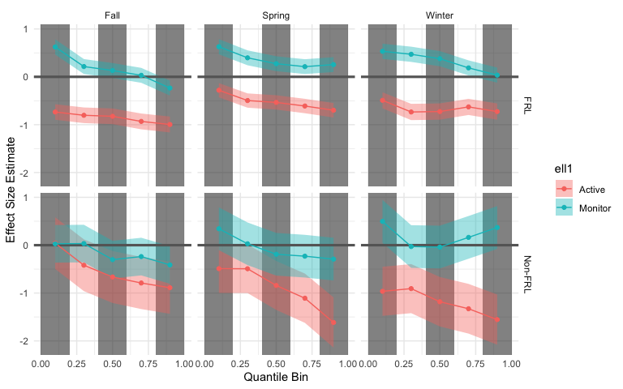
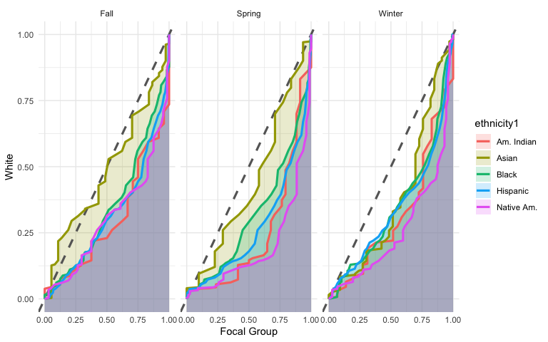
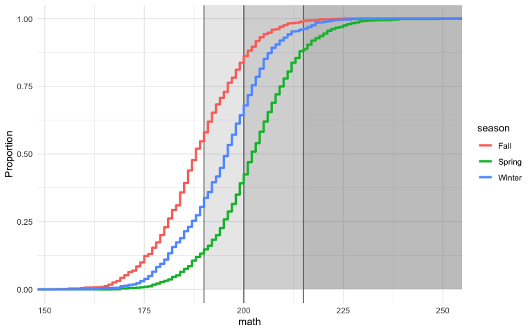

<!-- README.md is generated from README.Rmd. Please edit that file -->

# esvis

R Package for effect size visualization and estimation.

[](https://travis-ci.org/datalorax/esvis)
[](https://ci.appveyor.com/project/datalorax/esvis)
[](https://codecov.io/gh/datalorax/esvis)
[](https://cran.r-project.org/package=esvis)

This package is designed to help you very quickly estimate and visualize
distributional differences by categorical factors (e.g., the effect of
treatment by gender and income category). Emphasis is placed on
evaluating distributional differences across the entirety of the scale,
rather than only by measures of central tendency (e.g., means).

## Installation

Install directly from CRAN with

``` r
install.packages("esvis")
```

Or the development version (heavily updated, a new CRAN release is
planned soon) from GitHub with:

``` r
# install.packages("devtools")
devtools::install_github("datalorax/esvis")
```

## Plotting methods

There are three primary data visualizations: (a) binned effect size
plots, (b) probability-probability plots, and (c) empirical cumulative
distribution functions. All plots use the
[ggplot2](http://ggplot2.tidyverse.org) package and are fully
manipulable after creation using standard ggplot commands (e.g.,
changing the theme, labels, etc.). These plots were all produced by
first running `library(ggplot2); theme_set(theme_minimal())` to produce
the plots with the minimal theme, but no theme structure is imposed on
any of the plots.

### Binned ES Plot

At present, the binned effect size plot can only be produced with
Cohen’s *d*, although future development will allow the user to select
the type of effect size. The binned effect size plot splits the
distribution into quantiles specified by the user (defaults to lower,
middle, and upper thirds), calculates the mean difference between groups
within each quantile bin, and produces an effect size for each bin by
dividing by the overall pooled standard deviation (i.e., not by
quantile). For example

``` r
library(esvis)
binned_plot(benchmarks, math ~ ell)
#> Warning: `cols` is now required when using unnest().
#> Please use `cols = c(data, q)`
```

<!-- -->

Note that in this plot one can clearly see that the magnitude of the
differences between the groups depends upon scale location, as evidence
by the reversal of the effect (negative to positive) for the Non-ELL
(non-English Language Learners) group. We could also change the
reference group, change the level of quantile binning, and evaluate the
effect within other factors. For example, we can look by season
eligibility for free or reduced price lunch, with quantiles binning, and
non-ELL students as the reference group with

``` r
binned_plot(benchmarks, 
            math ~ ell + frl + season, 
            ref_group = "Non-ELL",
            qtile_groups = 5)
#> Warning: `cols` is now required when using unnest().
#> Please use `cols = c(data, q)`
```

<!-- -->

The `ref_group` argument can also supplied as a formula.

### PP Plots

Probability-probability plot can be produced with a call to `pp_plot`
and an equivalent argument structure. In this case, we’re visualizing
the difference in reading achievement by race/ethnicity by season.

``` r
pp_plot(benchmarks, reading ~ ethnicity + season)
#> Warning: `cols` is now required when using unnest().
#> Please use `cols = c(matched)`
```

<!-- -->


Essentially, the empirical cummulative distribution function (ECDF) for
the reference group (by default, the highest performing group) is mapped
against the ECDF for each corresponding group. The magnitude of the
achievement gap is then displayed by the distance from the diagonal
reference line, representing, essentially, the ECDF for the reference
group.

By default, the area under the curve is shaded, which itself is an
effect-size like measure, but this is also manipulable.

### ECDF Plot

Finally, the `ecdf_plot` function essentially dresses up the base
`plot.ecdf` function, but also adds some nice referencing features
through additional, optional arguments. Below, I have included the
optional `hor_ref = TRUE` argument such that horizontal reference lines
appear, relative to the cuts provided.

``` r
ecdf_plot(benchmarks, math ~ season, 
    cuts = c(190, 200, 215))
#> Warning: `cols` is now required when using unnest().
#> Please use `cols = c(ecdf, nd)`
```

<!-- -->

These are the curves that go into the PP-Plot, but occasionally can be
useful on their own.

## Estimation Methods

Compute effect sizes for all possible pairwise comparisons.

``` r
coh_d(benchmarks, math ~ season + frl)
#> # A tibble: 30 x 6
#>    season_ref frl_ref season_foc frl_foc      coh_d     coh_se
#>    <chr>      <chr>   <chr>      <chr>        <dbl>      <dbl>
#>  1 Fall       FRL     Fall       Non-FRL  0.7443868 0.07055679
#>  2 Fall       FRL     Spring     FRL      1.321191  0.04957348
#>  3 Fall       FRL     Spring     Non-FRL  2.008066  0.07873488
#>  4 Fall       FRL     Winter     FRL      0.6246112 0.04716189
#>  5 Fall       FRL     Winter     Non-FRL  1.300031  0.07326622
#>  6 Fall       Non-FRL Fall       FRL     -0.7443868 0.07055679
#>  7 Fall       Non-FRL Spring     FRL      0.5498306 0.06939873
#>  8 Fall       Non-FRL Spring     Non-FRL  1.140492  0.09189070
#>  9 Fall       Non-FRL Winter     FRL     -0.1269229 0.06934576
#> 10 Fall       Non-FRL Winter     Non-FRL  0.5009081 0.08716735
#> # … with 20 more rows
```

Or specify a reference group. In this case, I’ve used the formula-based
interface, but a string vector specifying the specific reference group
could also be supplied.

``` r
coh_d(benchmarks, 
      math ~ season + frl, 
      ref_group = ~Fall + `Non-FRL`)
#> # A tibble: 5 x 6
#>   season_ref frl_ref season_foc frl_foc      coh_d     coh_se
#>   <chr>      <chr>   <chr>      <chr>        <dbl>      <dbl>
#> 1 Fall       Non-FRL Fall       FRL     -0.7443868 0.07055679
#> 2 Fall       Non-FRL Spring     FRL      0.5498306 0.06939873
#> 3 Fall       Non-FRL Spring     Non-FRL  1.140492  0.09189070
#> 4 Fall       Non-FRL Winter     FRL     -0.1269229 0.06934576
#> 5 Fall       Non-FRL Winter     Non-FRL  0.5009081 0.08716735
```

Notice that the reference to Non-FRL is wrapped in back-ticks, which
should be used anytime there are spaces or other non-standard
characters.

Other effect sizes are estimated equivalently. For example, compute *V*
([Ho, 2009](https://www.jstor.org/stable/40263526?seq=1#page_scan_tab_contents))
can be estimated with

``` r
v(benchmarks, 
  math ~ season + frl, 
  ref_group = ~Fall + `Non-FRL`)
#> # A tibble: 5 x 5
#>   frl_ref season_ref frl_foc season_foc          v
#>   <chr>   <chr>      <chr>   <chr>           <dbl>
#> 1 Non-FRL Fall       FRL     Fall       -0.7051069
#> 2 Non-FRL Fall       FRL     Spring      0.5454666
#> 3 Non-FRL Fall       FRL     Winter     -0.1117226
#> 4 Non-FRL Fall       Non-FRL Spring      1.139235 
#> 5 Non-FRL Fall       Non-FRL Winter      0.5070737
```

or *AUC* with

``` r
auc(benchmarks, 
    math ~ season + frl, 
    ref_group = ~Fall + `Non-FRL`)
#> # A tibble: 5 x 5
#>   frl_ref season_ref frl_foc season_foc       auc
#>   <chr>   <chr>      <chr>   <chr>          <dbl>
#> 1 Non-FRL Fall       FRL     Fall       0.3090356
#> 2 Non-FRL Fall       FRL     Spring     0.6501417
#> 3 Non-FRL Fall       FRL     Winter     0.4685164
#> 4 Non-FRL Fall       Non-FRL Spring     0.7897519
#> 5 Non-FRL Fall       Non-FRL Winter     0.6400361
```
